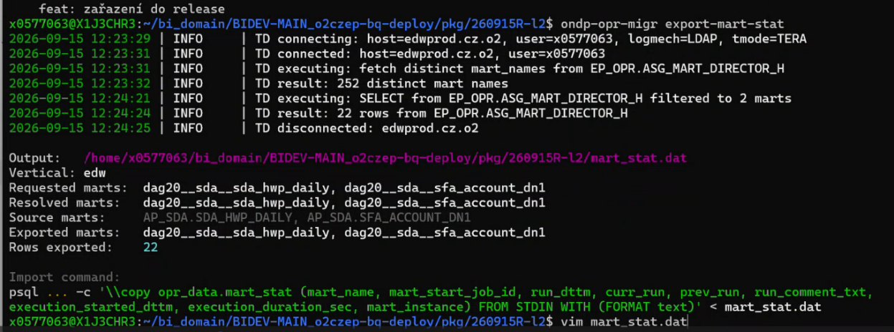
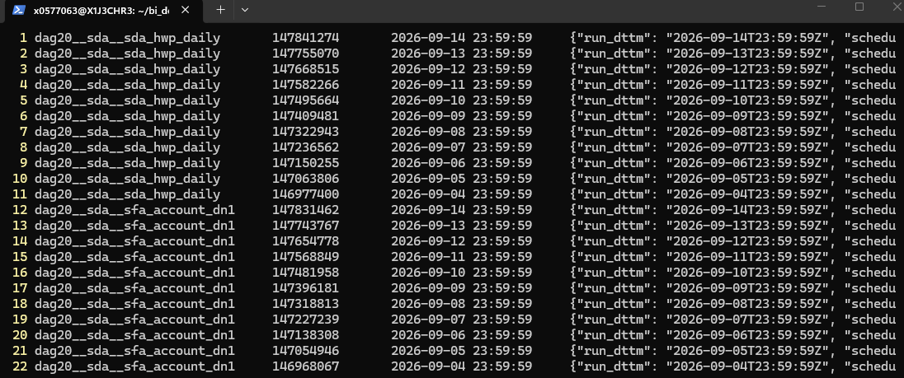
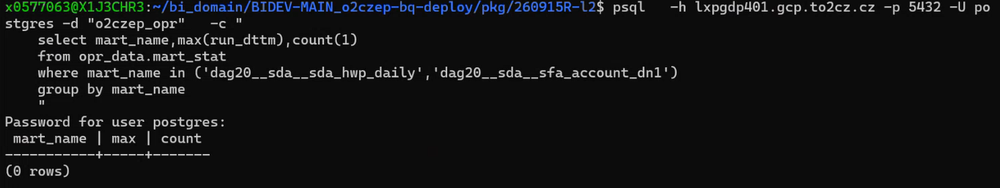
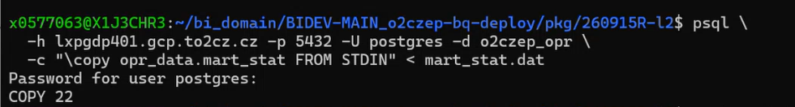
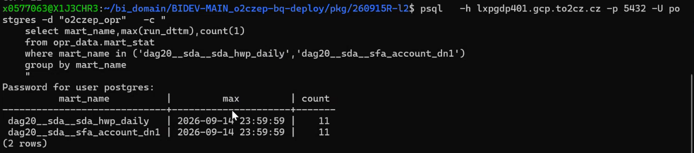
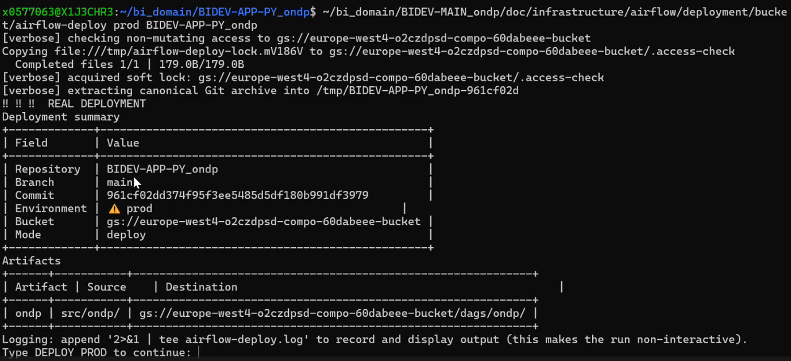

# Manuál – nasazení L2 async martů

_Teradata -> EM1 -> CloudSQL (metadata) -> BQ (data) -> Airflow bucket (dag20)_

## Účel dokumentu

Tento dokument popisuje postup nasazení tzv. L2 async datamartů. Na rozdíl od STG ingestu se zde navíc migrují provozní metadata datamartů z Teradaty do CloudSQL (Postgres) a nasazuje se i kód na produkční Airflow bucket (dag20). Postup vychází z hrubých poznámek z nasazení a z poznámek pro release 260915R-l2 (tabulky sfa_account_dn1 a hwp_credit_hierarchy) – u konkrétních cest/release čísel vždy dosadit aktuální release.

## 0. Předpoklady

- [ ] Funkční WSL prostředí, customizované podle interního starter kitu.
- [ ] Ve WSL naklonované repozitáře, ze kterých se nasazuje, a migrační repo (BIDEV-MAIN_o2czep-bq-deploy, BIDEV-APP-PY_ondp, BIDEV-MAIN_o2czep-dag20, BIDEV-MAIN_ondp).
- [ ] Přístup do Teradaty (LDAP heslo do domény, nebo TD heslo přímo do Teradaty).
- [ ] Přístup do CloudSQL/Postgres (o2czep_opr) – heslo pro uživatele **postgres**.
- [ ] Přístup do aplikace EDW Data Migration Inventory (klonování dat TD -> EM1).
- [ ] Přístup do produkčního Airflow UI.
- [ ] Nainstalovaný gcloud (pro deploy na bucket) a nástroj uv (Python package/tool manager).
**L2 – nasazujeme pouze z WSL:** Na rozdíl od STG ingestu, který se spouští z Windows PowerShellu, se metadatová část L2 nasazení provádí výhradně z WSL.

## Rychlý přehled postupu

- [ ] Zastavit na produkci dag20__conductor a všechny ostatní dag20 dagy.
- [ ] Naklonovat (migrovat) potřebné tabulky z Teradaty do EM1 přes EDW Data Migration Inventory.
- [ ] Připravit/aktualizovat nástroj ondp-opr-migr ve WSL. (pouze jednorázově)
- [ ] Exportovat metadata datamartů z Teradaty (ondp-opr-migr export-mart-stat).
- [ ] Kontrola 1: zkontrolovat obsah souboru mart_stat.dat.
- [ ] Kontrola 2: ověřit v Postgres, že marty tam ještě nemají žádný záznam.
- [ ] Naimportovat mart_stat.dat do Postgres (CloudSQL).
- [ ] Kontrola 3: ověřit v Postgres, že záznamy už jsou vidět.
- [ ] Nasadit přeplach tabulek do BQ (sda_data) – obdoba STG ingestu, na Windows.
- [ ] Nasadit případný datafix (např. změna nullability sloupců).
- [ ] Nasadit sdílený kód na bucket (BIDEV-APP-PY_ondp) – DEPLOY PROD.
- [ ] Nasadit dag20 na bucket (BIDEV-MAIN_o2czep-dag20) – DEPLOY PROD.
- [ ] Počkat na synchronizaci (~2 minuty), obnovit Airflow UI, zkontrolovat nové dagy.
- [ ] Znovu zapnout ostatní dag20 dagy, které byly na začátku vypnuté.

## 1. Zastavení produkčních DAG20 dagů

Před zahájením nasazení jdeme na produkci a zastavíme dag dag20__conductor a všechny ostatní dag20 dagy (aby zpracování nezasahovalo do migrovaných dat).

```
https://44f7f5deee7e48eb9427f7ffc787d997-dot-europe-west4.composer.googleusercontent.com/dags
```

**Pozor / Doplnit:** doplnit přesný postup zjištění, které dag20 dagy byly aktivní před vypnutím (např. screenshot/export seznamu), aby šlo po nasazení spolehlivě obnovit stejný stav. Autor poznámek sám uvádí, že zatím chybí automatizace (viz kapitola 8).

## 2. Klonování dat z Teradaty do EM1

Provádí se přes aplikaci EDW Data Migration Inventory

1. Nastavit správný zdrojový dataset, např. ap_sda.
1. Vybrat konkrétní tabulky, které se migrují (např. sfa_account_dn1, hwp_credit_hierarchy).
1. Zaškrtnout Skip Validate a zadat TAG dané migrace – podle TAGu se později ověří, že migrace doběhla.
1. Počkat, až migrace dojede – teprve pak pokračovat dalším krokem.

## 3. Instalace / aktualizace nástroje ondp-opr-migr (WSL) – pouze jednourázově další nasazení není potřeba.

Nástroj slouží k přenosu metadat datamartů z Teradaty do CloudSQL (Postgres). Pokud ho ještě nemáme nainstalovaný nebo chceme aktuální verzi, provedeme:

```
cd ~/bi_domain/BIDEV-MAIN_ondp
git switch main
git pull
```

```
cd ~/bi_domain/BIDEV-MAIN_ondp/ondp-opr-migr
uv build
uv tool install ../dist/ondp_opr_migr-0.1.2-py3-none-any.whl
```

**Pozor / Doplnit:** název .whl souboru obsahuje konkrétní verzi (0.1.2) – před instalací ověřit aktuální verzi v adresáři dist/.

Konfigurace (spustí se interaktivní wizard):

```
ondp-opr-migr config --setup
```

Ve wizardu zadáváme:

| Dotaz wizardu | Co zadat |
| --- | --- |
| Teradata host | Stisknout ENTER, nic neměnit (výchozí hodnota). |
| Teradata username | Přihlašovací jméno ve tvaru x0... |
| Teradata password | Heslo do domény (LDAP), nebo heslo přímo do Teradaty (TD). |
| Volba mechanismu (další dialog) | TAB pro přepnutí, vybrat LDAP (pokud jsem zadal heslo do domény) nebo TD (pokud jsem zadal heslo do Teradaty). |
| Volba (další dialog) | TAB a vybrat TERA. |
| CloudSQL PostgreSQL username | Nechat prázdné. |

## 4. Získání (export) metadat z připraveného balíčku

Ve VPN nezapomenout nejdřív zapnout proxy (proxy-on) – externisté musí použít vždy.

Ověřit, že repo s balíčkem je aktuální (na branchi main):

```
cd ~/bi_domain/BIDEV-MAIN_o2czep-bq-deploy
git switch main
git pull
git log -n1
```

Přejít do adresáře konkrétního release a spustit export:

```
cd ~/bi_domain/BIDEV-MAIN_o2czep-bq-deploy/pkg/260915R-l2
ondp-opr-migr export-mart-stat
```

Spustí se textový wizard:

1. Vybrat konkrétní vertikálu EDW / VODWH / HR (přepínání tabulátorem).
1. Vyhledat konkrétní dag – zatím jednu po druhé, např. dag20__sda__sda_hwp_daily.
1. Potvrdit výběr křížkem, nebo CTRL+A (vybrat vše z výsledku hledání).
1. Smazat vyhledávací pole (CTRL+W) a zadat další hledaný dag (např. dag20__sda__sfa_account_dn1), znovu potvrdit.
1. Po výběru všech martů potvrdit exportstisknutím F10.


_Výstup příkazu ondp-opr-migr export-mart-stat – přehled exportovaných martů._

Vznikne datový soubor s exportovanými metadaty (v ukázce 22 řádků pro 2 vybrané marty):

```
~/bi_domain/BIDEV-MAIN_o2czep-bq-deploy/pkg/260915R-l2/mart_stat.dat
```

### Kontrola 1: obsah souboru mart_stat.dat

Soubor nesmí být prázdný a musí obsahovat oba očekávané datamarty:

```
vim ~/bi_domain/BIDEV-MAIN_o2czep-bq-deploy/pkg/260915R-l2/mart_stat.dat
```

Poslední (nejnovější) run_dttm u obou martů musí odpovídat dni předcházejícímu nasazení (typicky včerejšek vůči datu nasazení).



_Ukázka obsahu mart_stat.dat – poslední run_dttm pro oba marty._

### Kontrola 2: marty zatím nemají v Postgres žádný záznam

Cílem je ověřit, že v cílové tabulce v CloudSQL/Postgres zatím nejsou pro tyto marty žádná data (aby import v dalším kroku nezpůsobil duplicity). Připojení si vyžádá heslo uživatele postgres (heslo zkopírovat, uživatelské jméno do DB je postgres).

```
psql \
  -h lxpgdp401.gcp.to2cz.cz -p 5432 -U postgres -d "o2czep_opr" \
  -c "
    select mart_name,max(run_dttm),count(1)
    from opr_data.mart_stat
    where mart_name in ('dag20__sda__sda_hwp_daily','dag20__sda__sfa_account_dn1')
    group by mart_name
    "
```

Očekávaný výsledek: 0 řádků (prázdný výsledek).



_Kontrola 2 – před importem, výsledek 0 rows._

### Import datového souboru s historií do Postgres

```
cd ~/bi_domain/BIDEV-MAIN_o2czep-bq-deploy/pkg/260915R-l2
psql \
  -h lxpgdp401.gcp.to2cz.cz -p 5432 -U postgres -d o2czep_opr \
  -c "\copy opr_data.mart_stat FROM STDIN" < mart_stat.dat
```



_Import mart_stat.dat – COPY 22 (počet naimportovaných řádků)._

### Kontrola 3: po importu už marty musí mít záznamy

Spustit stejný select jako u Kontroly 2 – nyní očekáváme řádky s daty pro oba marty:

```
psql \
  -h lxpgdp401.gcp.to2cz.cz -p 5432 -U postgres -d "o2czep_opr" \
  -c "
    select mart_name,max(run_dttm),count(1)
    from opr_data.mart_stat
    where mart_name in ('dag20__sda__sda_hwp_daily','dag20__sda__sfa_account_dn1')
    group by mart_name
    "
```



_Kontrola 3 – po importu, oba marty mají po 11 záznamech._

**Tímto je metadatová část (Teradata -> CloudSQL) úspěšně dokončena.**

## 5. Nasazení dat do BQ (přeplach) – Windows

Tento krok je obdobou STG ingestu a provádí se na Windows

Přejít do adresáře BIDEV-MAIN_o2czep-bq-deploy (nebo použít BQ_nasazeni.bat).

1. Provést git pull, poté git log -n1 a ověřit, že máme aktuální repo.
1. Zkontrolovat config.txt připravený vývojářem ve složce k aktuálnímu release (stejně jako u STG ingestu).
1. Z každé připravené složky spustit preplach.bat soubor (standardní postup jako u ingestu STG).
Konkrétní příklad pro toto nasazení – přeplach tabulek podle konfigurace v:

```
BIDEV-MAIN_o2czep-bq-deploy\pkg\260915R-l2\260915-marts
```

Pokud je součástí nasazení i datafix (např. u tabulky hwp_credit_hierarchy se mění povinnost/nullability sloupců), spustit připravený nasazovací skript z podadresáře, např.:

```
BIDEV-MAIN_o2czep-bq-deploy\pkg\260915R-l2\BIDEV_hwp_daily\DB\_deployment_
```

## 6. Nasazení na Airflow bucket (WSL)

### 6.1 Sdílený kód (BIDEV-APP-PY_ondp)

```
cd ~/bi_domain/BIDEV-APP-PY_ondp
git switch main
git pull
git status
```

```
~/bi_domain/BIDEV-MAIN_ondp/doc/infrastructure/airflow/deployment/bucket/airflow-deploy prod BIDEV-APP-PY_ondp
```

Skript si může vyžádat přihlášení:

```
gcloud auth login
```

Následně se zobrazí souhrn nasazení – zkontrolovat repozitář, branch, commit a prostředí (prod):



_Deployment summary – kontrola repa/branch/commitu/bucketu před potvrzením._

Po kontrole potvrdíme zadáním textu DEPLOY PROD (přesně tak, jak skript vyžaduje). Počkáme, až nasazení dojede, než pokračujeme dalším repozitářem.

### 6.2 dag20 (BIDEV-MAIN_o2czep-dag20)

Nasadit až po úspěšném dokončení předchozího kroku:

```
cd ~/bi_domain/BIDEV-MAIN_o2czep-dag20
git switch main
git pull
git status
```

```
~/bi_domain/BIDEV-MAIN_ondp/doc/infrastructure/airflow/deployment/bucket/airflow-deploy prod BIDEV-MAIN_o2czep-dag20
```

Opět zkontrolovat souhrn a potvrdit zadáním DEPLOY PROD.

```
Pojistka proti souběžnému nasazení: Pokud by předchozí spuštění příkazu (MAIN_ondp/doc/infrastructure/airflow/deployment/bucket/airflow-deploy prod BIDEV-APP-PY_ondp) selhalo nebo bylo přerušeno, může na bucketu zůstat zamykací (lock) soubor. Skript v takovém případě nahlásí, že soubor už existuje, a zeptá se, co s ním udělat (smazat / pokračovat). Jde o záměrnou pojistku pro případ, že by nasazení souběžně spouštělo více lidí.
```

**Doporučení z Google dokumentace:** Po úspěšném nasazení počkat cca 2 minuty – jde o čas potřebný pro synchronizaci bucketu.

## 7. Spuštění DAG20 po nasazení

1. Počkat cca 2 minuty po nasazení (synchronizace bucketu).
1. Obnovit (refresh) produkční Airflow UI.
1. Nové/aktualizované marty se objeví v seznamu dagů a budou rovnou zapnuté.
1. Ručně zapnout i ostatní dag20 dagy, které byly na začátku (krok 1) vypnuté.
```
https://44f7f5deee7e48eb9427f7ffc787d997-dot-europe-west4.composer.googleusercontent.com/dags
```

## 8. Otevřené body / TODO

Chybí automatizace pro zapamatování, které dag20 dagy byly zapnuté před vypnutím, a jejich automatické zpětné zapnutí po nasazení. Prozatím se to řeší ručně (a je třeba dávat pozor, aby se na žádný zapomenutý dag nezapomnělo).
