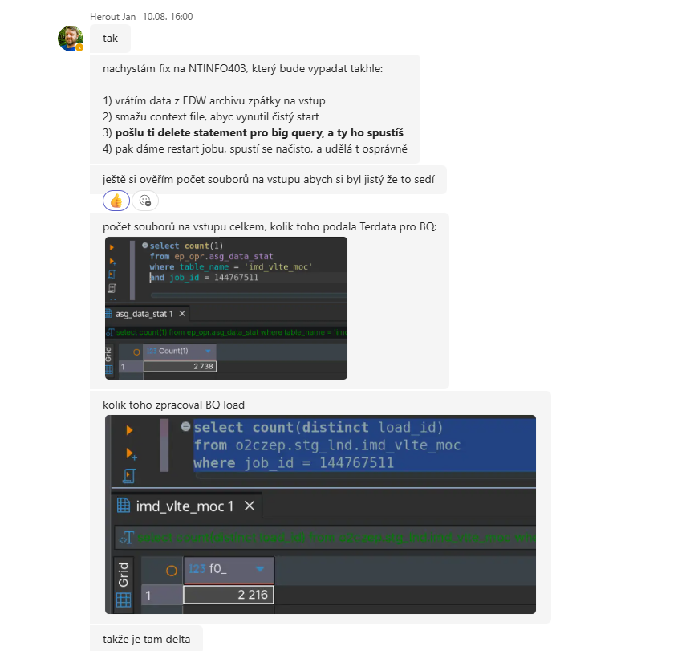
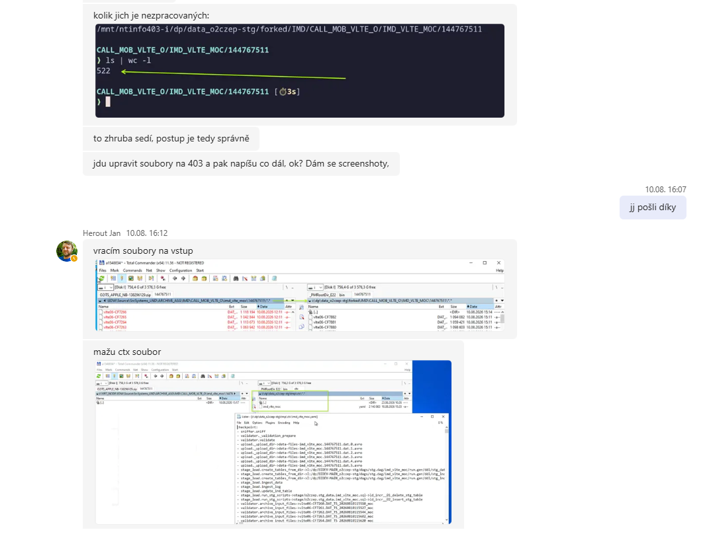
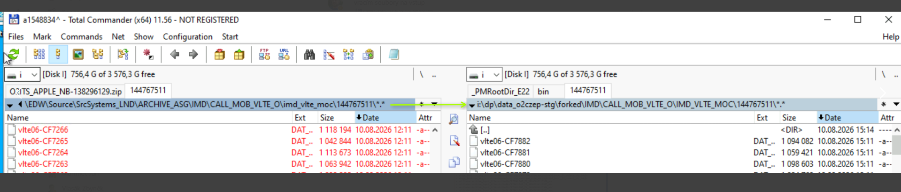
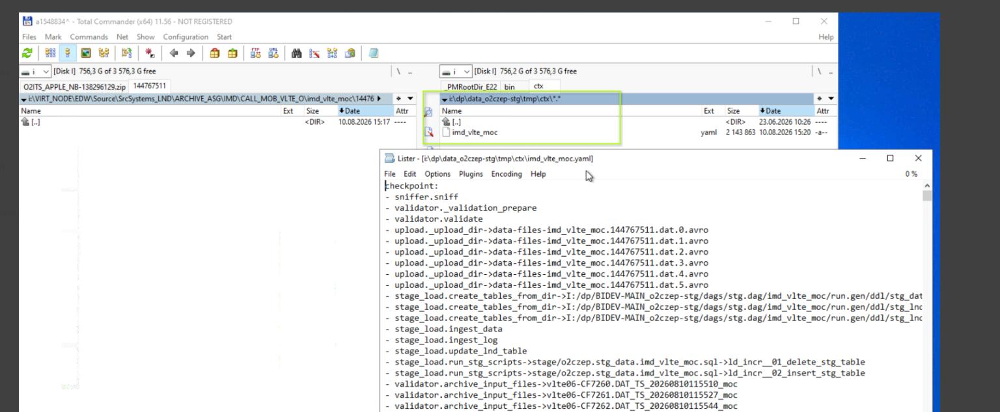
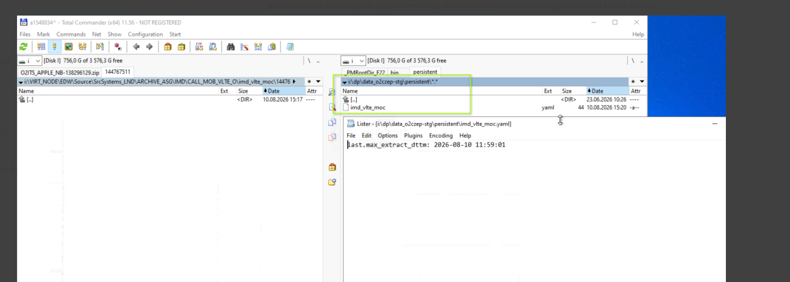
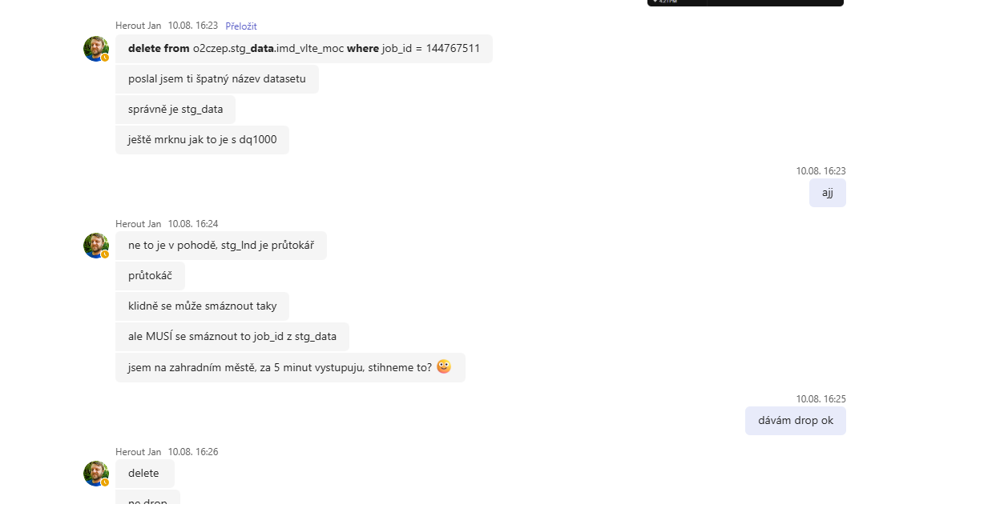

# Oprava neúplně zpracovaného loadu z Teradata do BigQuery

## Účel

Tento postup použij v situaci, kdy Teradata připravila pro BigQuery určitý počet vstupních souborů, ale BigQuery load zpracoval jen část z nich.

Příklad z incidentu:

- tabulka: `imd_vlte_moc`
- `job_id`: `144767511`
- Teradata připravila: `2738` souborů
- BigQuery zpracoval: `2216` `load_id`
- nezpracovaných souborů: `522`

Kontrola:

`2738 - 2216 = 522`

Počet nezpracovaných souborů na filesystemu tedy musí odpovídat rozdílu mezi Teradatou a BigQuery.

---

## 1. Ověřit počet souborů připravených Teradatou

Na Teradatě ověř počet vstupních souborů pro konkrétní tabulku a `job_id`.

```sql
SELECT COUNT(1)
FROM ep_opr.asg_data_stat
WHERE table_name = 'imd_vlte_moc'
  AND job_id = 144767511;
```

V našem případě:

```text
2738
```

Toto je očekávaný celkový počet souborů na vstupu.

---

## 2. Ověřit, kolik souborů už zpracoval BigQuery load

V BigQuery zkontroluj počet unikátních `load_id` pro stejný `job_id`.

```sql
SELECT COUNT(DISTINCT load_id)
FROM `o2czep.stg_lnd.imd_vlte_moc`
WHERE job_id = 144767511;
```

V našem případě:

```text
2216
```

Rozdíl:

```text
2738 - 2216 = 522
```

---

## 3. Ověřit nezpracované soubory na serveru

Na NTINFO403 zkontroluj adresář daného jobu, například:

```text
/mnt/ntinfo403-i/dp/data_o2czep-stg/forked/IMD/CALL_MOB_VLTE_O/IMD_VLTE_MOC/144767511
```

Počet souborů:

```bash
ls | wc -l
```

Očekávaný výsledek v tomto případě:

```text
522
```

Počet musí odpovídat rozdílu mezi počtem souborů z Teradata a počtem již zpracovaných `load_id` v BigQuery.

---

## 4. Vrátit archivované soubory zpět na vstup

Pokud jsou již zpracované / archivované soubory v EDW archivu, vrať příslušné soubory zpět do vstupního adresáře pro daný `job_id`.

Po vrácení souborů znovu zkontroluj jejich počet.

Cílem je, aby počet souborů na vstupu odpovídal počtu, který pro daný job připravila Teradata.

---

## 5. Smazat CTX soubor

Před restartem jobu smaž jeho context / CTX soubor, aby se job při dalším spuštění nepokoušel pokračovat ze starého checkpointu.

Typicky jde o soubor v adresáři jobu, např.:

```text
imd_vlte_moc.ctx
```

> Poznámka: podle konkrétní implementace nemusí být CTX vždy nutné smazat, ale při této opravě se maže pro jistotu, aby se job spustil čistě.

---

## 6. Zkontrolovat a případně odstranit zarážku

Ověř, zda v adresáři není soubor používaný jako zarážka / kontrolní stav.

Pokud tam je a podle běžného provozního postupu nemá zůstat, odstraň ho.

Tento krok dělej pouze pokud víš, že konkrétní soubor skutečně slouží jako zarážka pro tento load.

---

## 7. Smazat již nahraná data pro daný job z BigQuery

### Důležité

Správný dataset je:

```text
stg_data
```

Ne `stg_lnd`.

Před samotným `DELETE` je vhodné udělat kontrolní SELECT:

```sql
SELECT
  COUNT(*) AS rows_to_delete,
  COUNT(DISTINCT load_id) AS load_ids_to_delete
FROM `o2czep.stg_data.imd_vlte_moc`
WHERE job_id = 144767511;
```

Pokud výsledek odpovídá očekávání, proveď:

```sql
DELETE FROM `o2czep.stg_data.imd_vlte_moc`
WHERE job_id = 144767511;
```

V BigQuery není po běžném DML příkazu `DELETE` potřeba samostatný `COMMIT`.

---

## 8. Ověřit, že jsou data opravdu smazaná

Po `DELETE` spusť:

```sql
SELECT COUNT(*)
FROM `o2czep.stg_data.imd_vlte_moc`
WHERE job_id = 144767511;
```

Očekávaný výsledek:

```text
0
```

Pokud se nevrátí `0`, job zatím nerestartuj.

---

## 9. Restartovat job

Až když platí všechny kontroly:

- vstupní soubory jsou vrácené,
- jejich počet sedí,
- CTX je smazaný,
- případná zarážka je vyřešená,
- data daného `job_id` jsou z `stg_data` smazaná,
- kontrolní `COUNT(*)` vrací `0`,

můžeš job poslat na restart.

---

## 10. Kontrola po restartu

Po dokončení jobu znovu ověř počet zpracovaných loadů:

```sql
SELECT COUNT(DISTINCT load_id)
FROM `o2czep.stg_lnd.imd_vlte_moc`
WHERE job_id = 144767511;
```

A podle potřeby také cílová data:

```sql
SELECT COUNT(*)
FROM `o2czep.stg_data.imd_vlte_moc`
WHERE job_id = 144767511;
```

Výsledný počet `load_id` by měl odpovídat počtu vstupních souborů připravených Teradatou.

---

# Rychlý checklist

- [ ] Zjistit `table_name` a `job_id`.
- [ ] Ověřit počet souborů připravených Teradatou.
- [ ] Ověřit `COUNT(DISTINCT load_id)` v BigQuery.
- [ ] Spočítat rozdíl.
- [ ] Ověřit počet nezpracovaných souborů na NTINFO403 pomocí `ls | wc -l`.
- [ ] Potvrdit, že rozdíl = počet nezpracovaných souborů.
- [ ] Vrátit archivované soubory na vstup.
- [ ] Ověřit finální počet vstupních souborů.
- [ ] Smazat CTX soubor.
- [ ] Ověřit / odstranit případnou zarážku.
- [ ] Udělat kontrolní SELECT nad `o2czep.stg_data.<table>`.
- [ ] Smazat z `stg_data` data daného `job_id`.
- [ ] Ověřit, že `COUNT(*) = 0`.
- [ ] Restartovat job.
- [ ] Po doběhu ověřit počet `load_id` a výsledná data.

---

## Šablona pro příště

Nahraď pouze hodnoty:

```text
TABLE_NAME = <table_name>
JOB_ID     = <job_id>
PROJECT    = o2czep
```

Teradata:

```sql
SELECT COUNT(1)
FROM ep_opr.asg_data_stat
WHERE table_name = '<table_name>'
  AND job_id = <job_id>;
```

BigQuery – počet již zpracovaných loadů:

```sql
SELECT COUNT(DISTINCT load_id)
FROM `o2czep.stg_lnd.<table_name>`
WHERE job_id = <job_id>;
```

BigQuery – kontrola před smazáním:

```sql
SELECT
  COUNT(*) AS rows_to_delete,
  COUNT(DISTINCT load_id) AS load_ids_to_delete
FROM `o2czep.stg_data.<table_name>`
WHERE job_id = <job_id>;
```

BigQuery – smazání:

```sql
DELETE FROM `o2czep.stg_data.<table_name>`
WHERE job_id = <job_id>;
```

BigQuery – kontrola po smazání:

```sql
SELECT COUNT(*)
FROM `o2czep.stg_data.<table_name>`
WHERE job_id = <job_id>;
```

Až výsledek vrátí `0`, pokračuj restartem jobu.


Printscréén záloha



   






A pak v oflow restart toho padlého jobu 